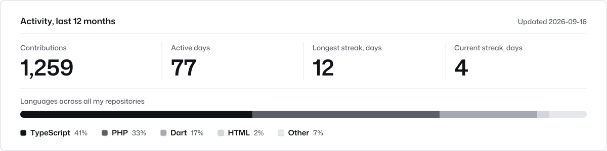

<picture>
  <source media="(prefers-color-scheme: dark)" srcset="assets/banner-dark.svg">
  
</picture>

**Full-stack developer from West Kalimantan, Indonesia.** I build web and mobile products for real businesses, and I run the production server they live on.

### Products

| Product | What it does |
| :-- | :-- |
| **[Crypt-Man](https://crypt.amincloud.id)** `live` | Password generator with in-browser encryption: the server never sees your plaintext Next.js · Prisma |
| **Ownertech.id** [`preview`](https://mrafiqamin24.github.io/App-POS/) | Point of sale for shops, offline-first on Windows and Android Laravel · Flutter |
| **Restotech.id** | Multi-tenant restaurant app: QR table ordering, kitchen and finance Next.js · Prisma |
| **Homtech.id** | Multi-tenant hotel and lodging management Next.js · Prisma |
| **PlatformHQ** | Operator console across Ownertech.id and Restotech.id Laravel · Filament |
| **Amin Cloud** | Self-hosted family drive Laravel · React |

Most product source code is private; demos and case studies are on my portfolio.

**Client work** · Toko Berkah Jaya (GPS attendance) · MR Hotel (booking app) · [MI Al-Amin Tumbang Titi](https://mrafiqamin24.github.io/MI-Al-Amin/) (school website)

**Homelab** · my own production server on Proxmox, with ZFS mirrors and Cloudflare Tunnel

<picture>
  <source media="(prefers-color-scheme: dark)" srcset="assets/stats-dark.svg">
  
</picture>

<b>Bahasa Indonesia</b>

 

Developer full-stack dari Kalimantan Barat. Saya membangun produk web dan mobile untuk usaha nyata: kasir toko, restoran, hotel, drive keluarga, dan aplikasi enkripsi Crypt-Man, lalu menjalankannya di server produksi milik sendiri. Kode produk bersifat privat; demo dan portofolio ada di tautan di bawah.

[Portfolio](https://portfolio.ownertech.id) · [Crypt-Man](https://crypt.amincloud.id)
